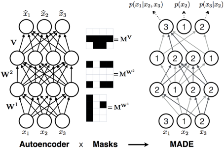

# Lecture 1: Deep Unsupervised Learning - Introduction
* [Course Website](https://sites.google.com/view/berkeley-cs294-158-sp20/home)
* Peter Abbeel-

# [Lecture 2: L2 Autoregressive Models](https://www.youtube.com/watch?v=iyEOk8KCRUw&list=PLwRJQ4m4UJjPiJP3691u-qWwPGVKzSlNP&index=2)
* Problems we'd like to solve:
    * _Generating data_: synthesizing images, videos, speech, text 
    * _Compressing data_: constructing efficient codes 
    * _Anomaly detection _
* **Likelihood-based models**: estimate $\mathbf{p}_{\text {data }}$ from samples $\mathbf{x}^{(1)}, \ldots, \mathbf{x}^{(n)} \sim \mathbf{p}_{\text {data }}(\mathbf{x})$ 
    * Learns a distribution $p$ that allows:
        * Computing $p(x)$ for arbitrary $x$ 
        * Sampling $x \sim p(x)$ 
* Today: _discrete data_
* Desiderata
    * want to estimate distributions of complex, high-dimensional data
    * computational and statistical efficiency
    * Efficient training and model representation
    * Expressiveness and generalization
    * Sampling quality and speed
    * Compression rate and speed
* The situation is hopeless without _function approximation_ because of the **curse of dimensionality**.
* **Parameterized distributions**
    * **function approximation**: learn θ so that $p_\theta(x) ≈ p_{data}(x)$
    * The field of deep generative models is concerned with jointly designing these ingredients to train flexible and powerful models $p_\theta$ capable of approximating distributions over high-dimensional data $\mathbf{x}$.
* **Maximum likelihood**: 
    * **empirical distribution**: $\hat p_\mathrm{data}(\mathbf{x}) = \frac{1}{n} \sum_{i=1}^n \mathbf{1}[\mathbf{x} = \mathbf{x}^{(i)}]$
    * **loss function**: $$\mathrm{KL}(\hat p_\mathrm{data} \,\|\, p_\theta) = \mathbb{E}_{\mathbf{x}\sim \hat p_\mathrm{data}}[-\log p_\theta(\mathbf{x})] - H(\hat p_\mathrm{data})$
    * **objective**: $\arg\min_\theta \ \mathrm{loss}(\theta, \mathbf{x}^{(1)}, \dotsc, \mathbf{x}^{(n)}) = \mathbb{E}_{\mathbf{x} \sim \hat p_\mathrm{data}}[-\log p_\theta(\mathbf{x})] =  \frac{1}{n}\sum_{i=1}^n -\log p_\theta(\mathbf{x}^{(i)})$
* _Designing the model_
    * Any setting of $\theta$ must define a valid probability distribution over $\mathbf{x}$:
        * for all $\theta$, $\sum_\mathbf{x} p_\theta(\mathbf{x}) = 1 \quad\text{and}\quad p_\theta(\mathbf{x}) \geq 0$, for all $\mathbf{x}$
    * $\log p_\theta(x)$ should be easy to evaluate and differentiate with respect to $\theta$
* **Bayes Nets**: Make the conditional distributions in the chain rule representable by inducing sparsity using independence assuptions.
* **Neural Models**: Make the conditional distributions using parameterisation.
* **Autoregressive Models**
    * Use NNs to represent the conditional distributions in $\log p_\theta(\mathbf{x}) = \sum_{i} \log p_\theta(x_i \,|\, \mathrm{parents}(x_i))$
        * $\log p(\mathbf{x})=\sum_{i=1}^{d} \log p\left(x_{i} \mid \mathbf{x}_{1: i-1}\right)$
    * Expressive as well as Tractable ML training compared to Bayes Nets
        * One function approximator per conditional distribution 
        * Parameters shared among conditional distributions
    * Ways to share parameters among conditional distributions to improve generalization and share information them.
        * _Recurrent Neural Nets (RNNs)_
        * _Masking_
* **Recurrent Neural Nets (RNNs)**
    * $\log p(\mathbf{x})=\sum_{i=1}^{d} \log p\left(x_{i} \mid \mathbf{x}_{1: i-1}\right)$
    * alot of parameter sharing
    * RNNs for 2D $\mathbf{x}$
        * method 1: **raster-scan** of the image
            * left-to-right row-by-row
            * not that great for images
        * method 2: Append position encoding of $(x,y)$ coordinates of pixel in the image as input to RNN
* **Masking-based Autoregressive Models**
    * Key property: **parallelized computation of all conditionals**
    * **Masked MLP (MADE: Masked Autoencoder for Distribution Estimation)**
        * 
        * _Parameter sharing across pixels_
        * _Fix an ordering of the input variables_ and then use masking to ensure that the network is structured to represent the conditional probability of each pixel given all previous pixels in the ordering.
            * Two types of layers:
                * Type A: don't have a horizontal connection
                * Type B: can have a horizontal connection
            * At least one type A layer required anywhere in the network..
	        * Can have multiple orderings.
        * The $p(\mathbf{x})$ output by the model will sum to 1 i.e. it is a proper probability distributions as each individual output is normalized by design and as long as each of the conditional distributions in the chain rule are proper distributions (which is the case here by the model design), the product is also a proper distribution.
        * _Sampling is slow_ as need to generate each pixel one-by-one given the last.
        * To ensure that we aren't memorising the training data, generate samples and find the pixel-level nearest neighbor in training data. _Shouldn't be exact copies of training samples._
        * **bits per dim**  = $\log p(x) / dim(x)$
        * **nats per dim** = $\ln p(x) / dim(x)$
    * **Masked convolutions & self-attention**
        * _Also share parameters across time_
        * **Masked  Temporal (1D) Convolution**
            * Pros:
                * Easy to implement masking in conv kernel.
                * _Constant param count_ for variable-length distribution.
                * Efficient to commpute
            * Con:
                * _Limited receptive field_: linear in the number of layer as opposed to $x_{1:k-1}$ for $x_k$ in MADE.
                    * Receptive Field of $x_k$ depends on filter size and #layers
        * **Wavenet**:
            * Each cell has a dilated convolution followed by parallel tanh (=signal) and sigmoid (=gate) multiplied together.
            * Pros:
                * _Improved receptive field_: Dilated Convolution with exponential dilation in each subsequent layer.
                * _Better expressivity_ : Gated Residual blocks, skip connections
            * Originally developed for speech generation
            * Can also be used to generate MNIST by appending position encoding to input.
        * **PixelCNN Variants**
            * _Problem with Wavenet , RNN_: Images can be flatten into 1D vectors, but they are fundamentally 2D.
            * **Masked Spatial (2D) Convolution**
                * First, impose an autoregressive ordering on 2D images
                * Use a masked variant of ConvNet that obeys this ordering
            * **PixelCNN **
                * Use a masked kernel to ensure that the ordering is obeyed
                    * style masking
                * Receptive field increases across layers
                * _Problems_:
                    * has a _blind spot_ - some pixels that came earlier in ordering are not used
                    * Pixel by pixel _sampling is slow_
            * **[Gated PixelCNN](http://sergeiturukin.com/2017/02/24/gated-pixelcnn.html)**
                * 2 streams of input: 
                    * Vertical stack: a 2D convolution for pixels above 
                    * Horizontal stack: 1D convolution for pixels on left
            * **PixelCNN++**
                * _Idea 1_: Moving away from softmax: we know nearby pixel values are likely to co-occur!
                * Mixture of logistic distributions
                * $\begin{aligned} \nu & \sim \sum_{i=1}^{K} \pi_{i} \operatorname{logistic}\left(\mu_{i}, s_{i}\right) \\ P(x \mid \pi, \mu, s) &=\sum_{i=1}^{K} \pi_{i}\left[\sigma\left(\left(x+0.5-\mu_{i}\right) / s_{i}\right)-\sigma\left(\left(x-0.5-\mu_{i}\right) / s_{i}\right)\right] \end{aligned}$
                * _Idea 2_: Capture long dependencies efficiently by downsampling 
    * **Masked Self-attention**
        * _Problem with convs_: limited receptive field => hard to capture long term dependencies
        * Self-attention => 
            * unlimited receptive field
            * O(1) parameter scaling w.r.t. data dimension
            * parallelized computation (v/s RNN)
        * _Pros_:
            * Arbitrary ordering (like MADE)
            * Parameter Sharing in each attention module (unlike MADE)
    * **Masked Attention + Convolution**
        * Ensures that signal doesn't need to propagate through many steps.
    * **Class-Conditional PixelCNN**
        * To force generating a specific label
        * Feed in a one-hot encoding for the desired label
    * **Hierarchical Autoregressive Models with Auxiliary Decoders**
    * **Image Super-Resolution with PixelCNN**
* **Pros and Cons of Autoregressive models**:
    * _Pros_:
        * Best in class modelling performance:
            * expressivity - autoregressive factorization is general
            * generalization - meaningful parameter sharing has good inductive bias
        * SOTA in multiple datasets and moalities
    * _Cons_: 
        * Slow sampling
            * Solution 1: caching of activations - no loss of model expressivity
            * Solution 2: break autoregressive pattern
        * No explicit latent representation
            * Solution: Fischer Score: $\dot{\ell}(x ; \theta)=\nabla_{\theta} \log p_{\theta}(x)$

### Flow Models
* _Goal_:
    * Fit a density model with **continuous** $x\in R^n$
        * Good fit to the training data (really, the underlying distribution!)
        * For new x, ability to evaluate
        * Ability to sample from
        * And, ideally, a **latent representation** that’s meaningful
* **Foundations of Flows (1-D)**
    * Maximum Likelihood:
        * $\max _{\theta} \sum_{i} \log p_{\theta}\left(x^{(i)}\right)$
        * $\arg\min_\theta \mathbb{E}_x [ -\log p_\theta (x) ]$ 
    * **Mixture of Gaussians**
        * $p_\theta(x) = \sum_{i=1}^k \pi_i \mathcal{N}(x; \mu_i, \sigma_i^2)$
        * doesn't work for high-dimensional data
            * If the sampling process involves picking a cluster center and adding gaussian noise, then a realistic image can be generated only if it is a cluster center, i.e. if it is already stored directly in the parameters.
    * Normalization to ensure a proper distribution is required as otherwise the model will simply give infinite probability to training sample.
        * discrete case: use softmax.
        * continuous case: harder .
    * **Flows**:
        * $x \to z = f_\theta(x)$, where $z \sim p_z(z)$
            * _Normalizing flow_: $z \sim \mathcal{N}(0, 1)$
        * **Training**
            * _Goal_: Learns $f_\theta(x)$ s.t. $z$ has distribution $p_z$
            * $\max\limits_\theta \sum\limits_{i}{\log p_\theta(x^{(i)})} = \max\limits_\theta \sum\limits_{i}{\log p_z(f_\theta(x^{(i)})) + \log \frac{\partial f_\theta}{\partial x}(x^{(i)})}$
            * The change of variables requires $f_\theta$ to be **differentiable** and **invertible**
                * Invertibility required for sampling: $z \to f_\theta^{-1}(z)$
                * $p_{\theta}(x) d x =p(z) dz$
            * $p_z$ is fixed during training. 
                * Could be Gaussian, uniform or some other easy distribution. 
        * **Sampling**
            * $\begin{aligned} z & \sim p_{Z}(z) \\ x &=f_{\theta}^{-1}(z) \end{aligned}$
        * **Practical Parametrizations of Flows**
            * Cumulative Density Functions (CDFs) for mapping to Uniform
                * Eg. CDF of Gaussian mixture density, CDF of mixture of logistics
            * Neural Net
                * If each layer is a flow, then sequencing of layers is flow
                    * Because composition of flows is also a flow
                    * Each layer:
                        * ReLU? No
                        * Sigmoid? Yes
                        * Tanh? Yes
        * Universality of flows: Every (smooth) distribution be represented by a (normalizing) flow
            * CDF: turns any density to Uniform distribution
            * Inverse CDF: turns Uniform to any density
            * => can have a flow from any density $x$ to any other density $y$: $x \to u \to z$
            * => can turn any (smooth) $p(x)$ into any (smooth) $p(z)$
* **2-D flows**
    * $x_1 \to z_1 = f_\theta(x_1)$
    * $x_2 \to z_2 = f_\phi(x_1, x_2)$
    * $\max\limits_\theta \sum\limits_{i}{\log p_\theta(x_1^{(i)})} = \max\limits_\theta \sum\limits_{i}{\log p_z(f_\theta(x_1^{(i)})) + \log \frac{\partial f_\theta}{\partial x_1}(x_1^{(i)}) + \log p_z(f_\phi(x_1^{(i)}, x_2^{(i)})) +  \log \frac{\partial f_\phi}{\partial x_1}(x_1^{(i)}, x_2^{(i)})}$
* **N-D flows**
    * Autoregressive Flows and Inverse Autoregressive Flows
    * **Autoregressive Flows **
        * **Sampling**
            * The sampling process of a Bayes net is a flow
                * $x_1 \sim p_\theta(x_1)$, $x_2 \sim p_\theta(x_2 | x_1)$, $x_3 \sim p_\theta(x_3 | x_1, x_2)$
            * Sampling is an **invertible** mapping from z to x
                * $x_1 = f_\theta^{-1}(z_1)$, $x_2 = f_\theta^{-1}(z_2; x_1)$, $x_3 = f_\theta^{-1}(z_3; x_1, x_2)$
        * **Trraining**
            * $p_{\theta}(\mathbf{x})=p\left(f_{\theta}(\mathbf{x})\right)\left|\operatorname{det} \frac{\partial f_{\theta}(\mathbf{x})}{\partial \mathbf{x}}\right|$
        * **x → z** - same structure as the **log-likelihood** computation of an autoregressive model
	        * $z_1 = f_\theta(x_1)$
	        * $z_2 = f_\theta(x_2; x_1)$
	        * $z_3 = f_\theta(x_3; x_1, x_2)$
	        * $z_k$ doesn't depend on $z_1, \dots, z_{k-1}$ so training is fast
        * **z → x** - same structure as the **sampling** procedure of an autoregressive model
            * $x_1 = f_\theta^{-1}(z_1)$
            * $x_2 = f_\theta^{-1}(z_2; x_1)$
            * $x_3 = f_\theta^{-1}(z_3; x_1, x_2)$
            * $x_k$ depends on $x_1, \dots, x_{k-1}$ so sampling is slow
    * **Inverse autoregressive flows**
        * **x → z** - same structure as the **sampling** procedure of an autoregressive model
            * $z_{1}=f_{\theta}^{-1}\left(x_{1}\right)$
            * $z_{2}=f_{\theta}^{-1}\left(x_{2} ; z_{1}\right)$
            * $z_{3}=f_{\theta}^{-1}\left(x_{3} ; z_{1}, z_{2}\right)$
            * $z_k$ depends on $z_1, \dots, z_{k-1}$ so training is slow
        * **z → x** - same structure as the **log-likelihood** computation of an autoregressive model
            * $x_{1}=f_{\theta}\left(z_{1}\right)$
            * $x_{2}=f_{\theta}\left(z_{2} ; z_{1}\right)$
            * $x_{3}=f_{\theta}\left(z_{3} ; z_{1}, z_{2}\right)$
            * $x_k$ doesn't depend on $x_1, \dots, x_{k-1}$ so sampling is slow
    * **AF vs IAF**
        * Autoregressive flow
            * Fast evaluation of $p(x)$ for arbitrary $x$
            * Slow sampling
        * Inverse autoregressive flow
            * Slow evaluation of $p(x)$ for arbitrary $x$, so training directly by maximum likelihood is slow.
            * Fast sampling
            * Fast evaluation of $p(x)$ if $x$ is a sample
        * _Problem with AF and IAF_: , both end up being as deep as the number of variables! Can do parameter sharing as in Autoregressive Models. e.g. RNN, masking.
    * _Change of Many Variables_
        * $p(x)\mathrm{vol}(dx) = p(z)\mathrm{vol}(dz)$
        * $p(x) = p(z) \frac{\mathrm{vol}(dz)}{\mathrm{vol}(dx)} = p(z) \mathrm{det}\left|\frac{dz}{dx}\right| = p(z) \mathrm{det}|J|$
                * $J$ is the Jacobian
                * If $SVD[J] = U \Sigma V^T$
                    * U and V are just rotating, $\Sigma$ is scaling
                    * $det(J)$ is the product of singular values
    * **Training**
        * $p_\theta(\mathbf{x}) = p(f_\theta(\mathbf{x})) \left| \det \frac{\partial f_\theta(\mathbf{x})}{\partial \mathbf{x}} \right|$
            * Now the $\det J$ must be easy to calculate and differentiate in addition to differentiability and invertibility of $f_\theta$
        * $\arg\min_\theta \mathbb{E}_\mathbf{x} \left[ -\log p_\theta(\mathbf{x}) \right] = \mathbb{E}_\mathbf{x} \left[ -\log p(f_\theta(\mathbf{x})) * \log \mathrm{det} \left| \frac{\partial f_\theta(\mathbf{x})}{\partial \mathbf{x}} \right| \right]$
        * Maximum likelihood objective $KL(data || f^{-1}(z))$ is equivalent to $KL(f(data) || z)$ -* i.e. training by maximum likelihood tries to make the latents match the prior. This makes sense: if this happens, then samples will be good.
* **Constructive Flows**
    * Flows can be composed $x \rightarrow f_{1} \rightarrow f_{2} \rightarrow \ldots f_{k} \rightarrow z$
        * $\begin{aligned} z &=f_{k} \circ \cdots \circ f_{1}(x) \\ x &=f_{1}^{-1} \circ \cdots \circ f_{k}^{-1}(z) \end{aligned}$
        * $\log p_{\theta}(x) =\log p_{\theta}(z)+\sum_{i=1}^{k} \log \left|\operatorname{det} \frac{\partial f_{i}}{\partial f_{i-1}}\right|$
    * **Affine Flows**
        * Convert a arbitrary multivariate Gaussian to multivariate standard Normal.
        * $f(x) = A^{-1}(x - b)$
        * Sampling: $x = Az + b$, where $z \sim N(0, I)$
        * Log likelihood involves calculating det(A)
    * **Elementwise flows**
        * $f_{\theta}\left(\left(x_{1}, \ldots, x_{d}\right)\right)=\left(f_{\theta}\left(x_{1}\right), \ldots, f_{\theta}\left(x_{d}\right)\right)$
        * Jacobian is diagonal so determinant is easy.
            * $\begin{aligned} \frac{\partial \mathbf{z}}{\partial \mathbf{x}} &=\operatorname{diag}\left(f_{\theta}^{\prime}\left(x_{1}\right), \ldots, f_{\theta}^{\prime}\left(x_{d}\right)\right) \\ \operatorname{det} \frac{\partial \mathbf{z}}{\partial \mathbf{x}} &=\prod_{i=1}^{d} f_{\theta}^{\prime}\left(x_{i}\right) \end{aligned}$
    * **NICE/RealNVP**
        * Affine Coupling Layer
            * $\mathbf{z}_{1: d / 2}=\mathbf{x}_{1: d / 2}$
            * $\mathbf{z}_{d / 2: d}=\mathbf{x}_{d / 2: d} \cdot s_{\theta}\left(\mathbf{x}_{1: d / 2}\right)+t_{\theta}\left(\mathbf{x}_{1: d / 2}\right)$
        * $s_\theta$ and $t_\theta$ can be arbitrary neural nets with no restrictions.
        * Jacobian is triangular, so its determinant is the product of diagonal entries
            * $\frac{\partial \mathbf{z}}{\partial \mathbf{x}}=\left[\begin{array}{cc} I & 0 \\ \frac{\partial \mathbf{z}_{d / 2: d}}{\partial \mathbf{x}_{1: d / 2}} & \operatorname{diag}\left(s_{\theta}\left(\mathbf{x}_{1: d / 2}\right)\right) \end{array}\right]$
            * $\operatorname{det} \frac{\partial \mathbf{z}}{\partial \mathbf{x}}=\prod_{k=1}^{d} s_{\theta}\left(\mathbf{x}_{1: d / 2}\right)_{k}$
        * How to partition variables?
            * checkerboard pattern
            * later after number of channels have been incresed, can split on channels.
* Glow, Flow++, FFJORD
* **Dequantization**: Fitting Continuous flows for discrete data
    * problem fitting continuous density models to discrete data: **degeneracy**
    * want the integral of probability density within a discrete interval to approximate discrete probability mass 
        * $P_{\mathrm{model}}(\mathbf{x}):=\int_{[0,1)^{D}} p_{\mathrm{model}}(\mathbf{x}+\mathbf{u}) d \mathbf{u}$
    * _Idea_: don't feed in discrete data as is but uniformally perturb it with noise drawn from $[0, 1]^D$
* **Future Directions for flows**
    * Ultimate Goal: a likelihood-based model with
        * fast sampling
        * fast inference
        * fast training
        * good samples
        * good compression

# Lecture 4: Latent Variable Models
* Autoregressive models + Flows: All random variables are observed
* Latent Variable Models (LVMs): Some random variables are hidden - we do not get to observe
* Why LVMs?
    * AR models are slow to sample because all pixels (observation dims) are assumed to be dependent on each other.
    * We can make part of observation space independent conditioned on some latent variables
        * Latent variable models can have faster sampling by exploiting statistical patterns
* **Training**
    * _Scenario 1_: z can only take on a small number of values → exact objective tractable
    * _Scenario 2_: z can take on an impractical number of values to enumerate → approximate
    * Objective
        * **Exact Likelihood Objective**: $\max _{\theta} \sum_{i} \log p_{\theta}\left(x^{(i)}\right)=\sum_{i} \log \sum_{z} p_{Z}(z) p_{\theta}\left(x^{(i)} \mid z\right)$
        * **Prior Sampling**
            * if $z$ can take on maky values -> sample $z$
            * $\sum_{i} \log \sum_{z} p_{Z}(z) p_{\theta}\left(x^{(i)} \mid z\right) \approx \sum_{i} \log \frac{1}{K} \sum_{k=1}^{K} p_{\theta}\left(x^{(i)} \mid z_{k}^{(i)}\right) \quad z_{k}^{(i)} \sim p_{Z}(z)$
            * Problem:
                * When $z$ is incorrect, $p_{\theta}\left(x^{(i)} \mid z\right)$ is small and not very informative
                * Sampling $z$ uniformly results in only in only $1/N$ terms being useful where $N$ is the number of unique data points
                * When going to higher dimensional data, it becomes very rare that a sampled $z$ is a good match for a data point $x(i)$
        * **Importance Sampling**
            * Want to compute $\mathbb{E}_{z \sim p_{Z}(z)}[f(z)]$ where it is
                * hard to sample from $p_Z(z)$
                * or samples from $p_Z(z)$ are not very informative
            * **objective**: $\sum_{i} \log \sum_{z} p_{Z}(z) p_{\theta}\left(x^{(i)} \mid z\right) \approx \sum_{i} \log \frac{1}{K} \sum_{k=1}^{K} \frac{p_{Z}\left(z_{k}^{(i)}\right)}{q\left(z_{k}^{(i)}\right)} p_{\theta}\left(x^{(i)} \mid z_{k}^{(i)}\right) \quad$ with $\left.\quad z_{k}^{(i)} \sim q\left(z_{k}^{(i)}\right)\right)$
                * If a $z_k^{(i)}$ with small $p_{Z}(z_{k}^{(i)})$ is sampled, the multiplier will be small
            * What is a good **proposal distribution $q(z)$**?
                * $q(z)=p_{\theta}\left(z \mid x^{(i)}\right)=\frac{p_{\theta}\left(x^{(i)} \mid z\right) p_{Z}(z)}{p_{\theta}\left(x^{(i)}\right)}$
                * Propose a parameterized distribution $q$ we know we can work (sample) with easily, 
                * and try to find a parameter setting that makes it as good as possible i.e. as close as possible to $p_\theta(z | x^{(i)})$
                    * **objective**: $\min _{q(z)} \mathrm{KL}\left(q(z) \| p_{\theta}\left(z \mid x^{(i)}\right)\right) = \min _{q(z)} \mathbb{E}_{z \sim q(z)}\left[\log q(z)-\log p_{Z}(z)-\log p_{\theta}\left(x^{(i)} \mid z\right)\right] +$ constant independent of $\mathrm{z}$
            * **Amortized Inference**
                * _General Idea of Amortization_: if same inference problem needs to be solved many times, can we parameterize a neural network to solve it?
                * Our case: for all $x^{(i)}$ we want to solve: $\min _{q(z)} \operatorname{KL}\left(q(z) \| p_{\theta}\left(z \mid x^{(i)}\right)\right.$
                * **Amortized objective**: $\min _{\phi} \sum_{i} \mathrm{KL}\left(q_{\phi}\left(z \mid x^{(i)}\right) \| p_{\theta}\left(z \mid x^{(i)}\right)\right)$
                    * Don't need to solve an optimization problem to find $q(z)$ for each $x^{(i)}$.
                * pro: faster, regularization
                * con: not as precise
            * **Importance Weighted Autoencoder (IWAE)**
                * objective: $\sum_{i} \log \frac{1}{K} \sum_{k=1}^{K} \frac{p_{Z}\left(z_{k}^{(i)}\right)}{q\left(z_{k}^{(i)}\right)} p_{\theta}\left(x^{(i)} \mid z_{k}^{(i)}\right) - \min _{\phi} \sum_{i} \operatorname{KL}\left(q_{\phi}\left(z \mid x^{(i)}\right) \| p_{\theta}\left(z \mid x^{(i)}\right)\right)$ 
                    * with $\left.z_{k}^{(i)} \sim q\left(z_{k}^{(i)}\right)\right)$
            * **VLB Maximization**
                * $\mathbb{E}_{\mathbf{x} \sim p_{\text {data }}}\left[\mathbb{E}_{\mathbf{z} \sim q_{x}(\mathbf{z})}\left[\log p(\mathbf{z})+\log p(\mathbf{x} \mid \mathbf{z})-\log q_{x}(\mathbf{z})\right]\right] \leq \mathbb{E}_{\mathbf{x} \sim p_{\text {data }}}[\log p(\mathbf{x})]$
        * **Optimization**
            * Problem is that the parameters $\phi$ w.r.t. which we want to optimise, is appearing in the expectation distribution.
            * Likelihood Ratio Gradients
            * Reparametrisation Trick Gradients
        * Why is VAE an Autoenoder?
            * $\log p_{\theta}(x) \geq \underbrace{\underbrace{\left(E_{z \sim q_{x}(z)} \log p_{\theta}(x \mid z)\right)}_{\text {Reconstruction loss }}-\underbrace{K L\left(q_{\phi}(z \mid x) \| p(z)\right)}_{Regularization}}_{L(\theta, \phi) \text { - VAE objective }}$
            * First term samples a $z$ from $q_x$ and checks how likely $x$ is to be sampled back from $p_\theta$
            * Second term forces the posterior $q_\phi$ to be simple and similar to the prior $p(z)$ so that the $z$ keeps just enough info about $x$ to reconstruct it.
            * Process: x -> $\mu, \sigma$ -> $z = \mu + \sigma \epsilon$ -> $p_{\theta}\left(z \mid x^{(i)}\right)$ -> $\hat{x}$
                * Due to perturbed $z = \mu + \sigma \epsilon$, similar $x$ should get mapped to same $x$
* **Variations of VAE**
    * **VQ-VAE**
    * **Beta VAE**
    * 

